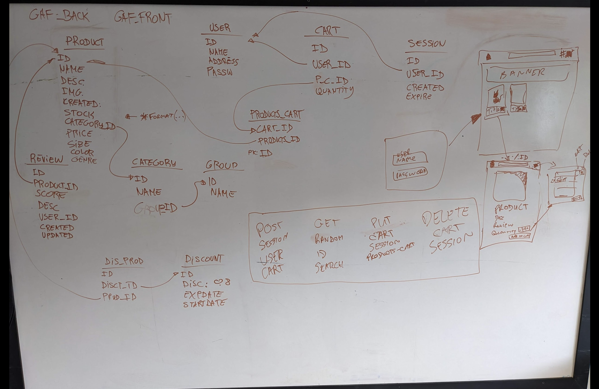

## Guidance

Answer the following questions considering the learning outcomes for

- [Week 4](https://learn.foundersandcoders.com/course/syllabus/developer/project-2-week-1/learning-outcomes/)
- [Week 5](https://learn.foundersandcoders.com/course/syllabus/developer/project-2-week-2/schedule/)
- [Week 6](https://learn.foundersandcoders.com/course/syllabus/developer/project-2-week-3/learning-outcomes/)

Make sure to record evidence of your processes. You can use code snippets, screenshots or any other material to support your answers.

Do not fill in the feedback section. The Founders and Coders team will update this with feedback on your progress.

## Assessment

### 1. Show evidence of some of the learning outcomes you have achieved this week.

> **[Learning outcomes...]**

Databases:

Learn how to design and structure a database schema for the application (K10, S8)
Implement CRUD (Create, Read, Update, Delete) operations for products and orders (S1, S3, S16)
Acquire skills in using SQLite to manage and query relational data efficiently (K10, S3)
Be comfortable with SQL syntax and how to use SELECT and INSERT queries (K10. S3)

Evidence:

Database schema design (

)

CRUD operations implementation (

    import { CartItem } from './tyBucket';
    export const fetchUpdateCart = async (
    cartId: number,
    userCartItems: Array<CartItem>,
    ) => {
    try {
    const response = await fetch(`${API_URL}/cart/${cartId}`, {
    method: 'PUT',
    headers: {
    'Content-Type': 'application/json',
    },
    body: JSON.stringify(userCartItems),
    });
    const contentType = response.headers.get('Content-Type');
    if (contentType && contentType.includes('application/json')) {
    const result = await response.json();
    return result;
    }
    } catch (error) {
    if (error instanceof Error) {
    alert(error.message);
    } else {
    alert('An unexpected error occurred');
    }
    }
    };

)

SQLite usage and query examples (

    export async function sqlUpdateCarts(cartId: number, newContent: any[]) {
    try {
    // Update the usercart table
    const updateCart = await db
    .prepare(
    `      UPDATE carts
    				SET completed = TRUE, completed_at = CURRENT_TIMESTAMP
    				WHERE id = ?
    	`,
    )
    .run(cartId);

    		if (updateCart.changes === 0) {
    			return `Cart was not found in the database`;
    		}

    		// Update the products_carts table
    		for (const item of newContent) {
    			const updateProductCart = await db
    				.prepare(
    					`
    					INSERT INTO products_carts (quantity, products_id, cart_id)
    					VALUES (?, ?, ?)
    					`,
    				)
    				.run(item.quantity, item.productId, cartId);

    			if (updateProductCart.changes === 0) {
    				return `Product ${item.productId} in cart was not found in the database`;
    			}
    		}

    		// Fetch the updated products_carts data and updated users_carts table
    		const productCartchanges = await db
    			.prepare(
    				`
    				SELECT * FROM products_carts
    				WHERE cart_id = ?
    				`,
    			)
    			.all(cartId);
    		const userCartchanges = await db
    			.prepare(
    				`
    				SELECT * FROM carts
    				WHERE id =?
    				`,
    			)
    			.all(cartId);

    		return { productCartchanges, userCartchanges };
    	} catch (error) {
    		console.error((error as Error).message);
    		return (error as Error).message;
    	}

    }

)

React:
Gain proficiency in using React to create dynamic and responsive user interfaces (K7, S2)
Understand the use of state management in React to handle the shopping cart functionality (K11, S10)

Evidence:

React components for user interface (

    export default function ImgDisplay({ imgurl, look }: ImgPropt) {
    if (look === 'thumbnail')
    return (
    
    );
    if (look === 'heroimage')
    return (
    
    );
    if (look === 'cartimage')
    return (
    
    );

    	if (look === 'productImage')
    		return ;

    }
    )

    State management implementation for shopping cart (
    export default function CartComponent({
    handleModalToggle,
    }: CartComponentProps) {
    const { user, setUser } = useUserContext();

    	useEffect(() => {
    		if (user?.cart && user.cart.length === 0) {
    			handleModalToggle();
    		}
    	}, [user, handleModalToggle]);

    	const handleClickOutside = (event: React.MouseEvent<HTMLDivElement>) => {
    		if (
    			event.target instanceof HTMLDivElement &&
    			event.target.classList.contains('cartycart')
    		) {
    			handleModalToggle();
    		}
    	};

    	const gloryToAFG = async () => {
    		try {
    			const createUserCart = await fetchCreateCart(420);
    			const createProductCart = await fetchUpdateCart(
    				createUserCart,
    				user!.cart!,
    			);

    			if (createProductCart.userCartchanges[0].completed === 1) {
    				// reset the user.cart to an empty array and generate an alert with message 'hooray'
    				setUser({ ...user!, cart: [] });
    				console.log(createProductCart);
    				return alert('hooray');
    			}

    			return console.log(createProductCart);
    		} catch (error) {
    			if (error instanceof Error) {
    				alert(error.message);
    			} else {
    				alert('An unexpected error occurred');
    			}
    		}
    	};

    	return (
    		

    			

    				

    					{user?.cart && user.cart.length > 0 ? (
    						user.cart.map((item) => (
    							

    								<CartItemComponent
    									productId={item.productId}
    									quantity={item.quantity}
    								/>
    							

    						))
    					) : (
    						

    							
Your cart is empty

    						

    					)}
    				

    				

    					<Button
    						btnText="Complete Your Order"
    						btnonClick={() => gloryToAFG()}
    						btnclassName="btnSecondary"
    					/>
    				

    			

    		

    	);

    }

)

### 2. Show an example of some of the learning outcomes you have struggled with and/or would like to re-visit.

> [**Learning outcome...**]

Testing:
Learn how to write unit tests, integration tests, and end-to-end tests using testing frameworks like Cypress (K12, S4, S5, S13)

Struggle:
Writing comprehensive tests for my application has been a challenge. I would like to spend more time learning about testing best practices and improving my test coverage.

Evidence:

Current test implementation (

    test('Renders main page and navbar elements', () => {
    render(
    	<UserContextProvider>
    		<App />
    	</UserContextProvider>,
    );

    // check for the navigation
    expect(screen.getByRole('navigation')).toBeInTheDocument();

    // Check for the Home link
    const homeLink = screen.getByRole('link', { name: /home/i });
    expect(homeLink).toBeInTheDocument();
    expect(homeLink).toHaveAttribute('href', '#');

    });

)

## Feedback (For CF's)

> [**Shaughn**]  
> [*What went well*]  
good evidence and learning goals refferenced.

> [*Even better if*]
Like we talked about the images should come with a bit more description of what they are showing and what you did to make it/why you did it. Also you could structure this in a way that its obvious which learning goal you are talking about since you list them in the begining then swap around.
